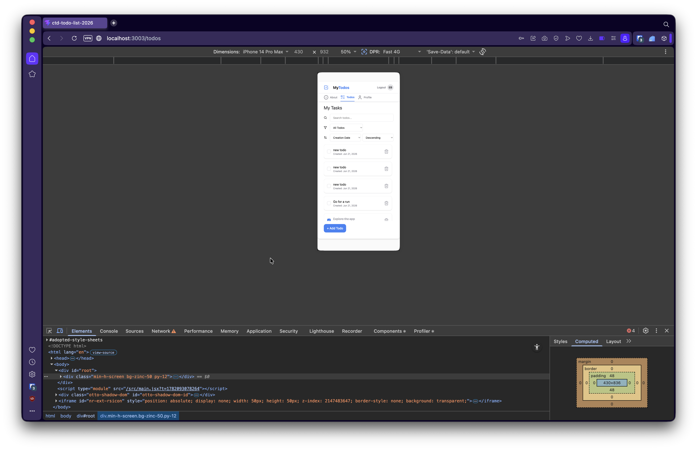
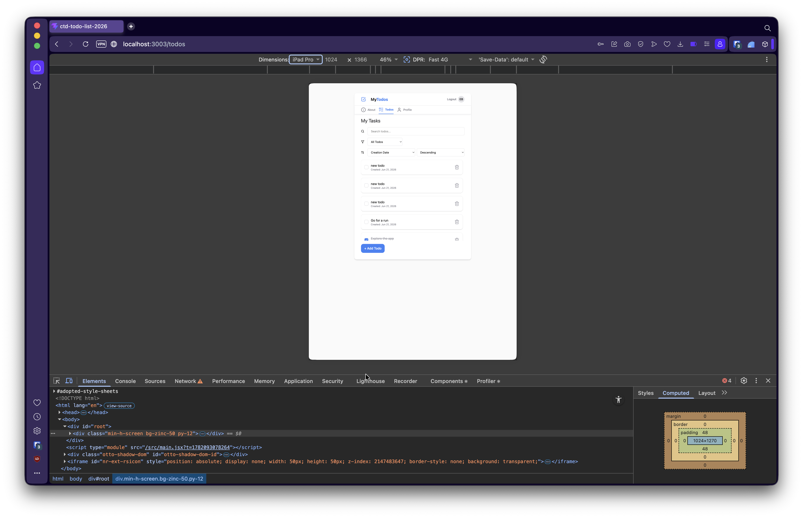
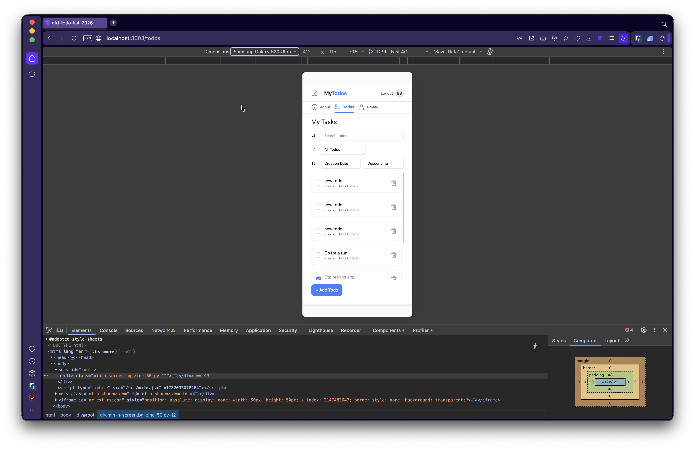
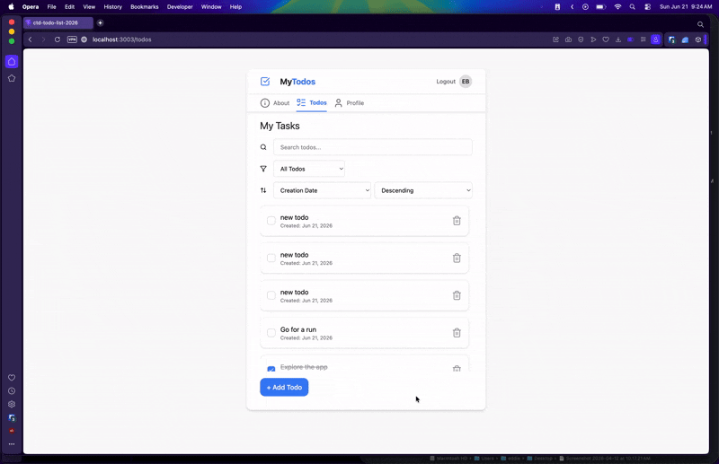

# Code The Dream Todo App


This is a simple todo app that allows a user to manage daily tasks. This app allows helps users stay organized by providing a straight-forward way to create, read, update and delete todos all in one place with a minimalist, feature rich user-interface.

---

## Live Demo

[View Live Demo](https://ctd-todo-list-2026.vercel.app/login)

---

## Screenshots

### Desktop View


### Mobile View





### Feature Demo




---

## Table of Contents

- [Features](#features)
- [Why I Built This](#why-i-built-this)
- [Installation](#installation)
- [Usage](#usage)
- [Project Structure](#project-structure)
- [Technologies Used](#technologies-used)
- [Design Decisions](#design-decisions)
- [Challenges Faced](#challenges-faced)
- [Future Improvements](#future-improvements)
- [License](#license)
- [Contact](#contact)

---

## Features

- Create Todos
- Manage Todos
- Persistent Storage
- User Todo-Related Stats

---

## Why I Built This

I built this project as part of my Code the Dream curriculum to deepen my understanding of React by building a production-quality todo application with persistent state, secure input handling, and reusable components.

---

## Installation

### Prerequisites

Required:

- nvm 0.39.0+
- Node.js 22+
- npm 10+

You need to have Node.js and npm installed. This project was developed with the Node.js version specified in the .nvmrc file.

Verify installation:

```bash
nvm -v
node -v
npm -v
```

---

### 1. Clone the repository

```bash
git clone https://github.com/ebordenave/ctd-todo-list-2026.git
```

### 2. Navigate into the project

```bash
cd ctd-todo-list-2026
```

### 3. Install dependencies

```bash
npm install
```

### 4. Set up environment variables

Create a .env file in the root of the project by copying the example file.

```bash
cp .env.example .env
```

Update the `VITE_TARGET` variable in the .env file to point to your backend API URL.

`VITE_TARGET=https://your-backend-api-url.com`

---

## Running the development server

Once the setup is complete, run the development server:

```bash
npm run dev
```

The application will be available at `http://localhost:3001`.

---

## Usage

How to use this application.

Example:

1. Open the application in your browser.
2. Sign up for an account or log in.
3. Create new todo items.
4. Manage tasks by editing, completing, or deleting them.

---

## Available Scripts

### `npm run dev`

Starts the Vite development server using the current working directory as the project root. This provides fast development features such as Hot Module Replacement (HMR) for instant updates while editing.

source: https://vite.dev/guide/

---

### `npm run build`

Builds the application for production. Vite bundles the project into optimized, minimized static assets and outputs them into the dist directory by default ready to be deployed.

source: https://v4.vitejs.dev/guide/static-deploy

---

### `npm run preview`

Starts a local static web server to preview the production build from the dist folder. This is useful for testing how the application will behave after deployment. Note: this is intended only for local previewing, not as a production server.

source: https://v4.vitejs.dev/guide/static-deploy

---

### `npm run lint`

Runs ESLint to analyze the code for potential errors and style issues.

---

## Project Structure

```text
src/
├── assets/
├── components/
├── contexts/
├── features/
├── hooks/
├── pages/
├── reducers/
├── shared/
├── utils/
└── App.jsx
```

This project’s folder structure is based on the organizational patterns provided through the Code the Dream curriculum, with minor adjustments to improve clarity and maintainability.

The goal is to create an intuitive structure that makes it easier for developers new to the codebase to navigate components, features, and application logic.

---

## Technologies Used

- React
- Vite
- JavaScript (ES6+)
- DOMPurify (for sanitizing user input)
- Tailwind CSS
- Lucide React (for lightweight and customizable icons)
- ESLint & Prettier (for code linting and formatting)

---

## Design Decisions

### Optimistic Updates

To improve the user experience, this application uses an optimistic update pattern for certain actions. Instead of waiting for the server to confirm a request before updating the UI, the application immediately updates local state and assumes success. If the request fails, the state can be rolled back or corrected. This makes the app feel faster and more responsive while reducing perceived latency.

---

### State Management

Depending on the type of state, the decision to use a reducer or a simple `useState` came down to how that state was being used and shared throughout the application. What I realized during this project is that centralization and modularity make managing a codebase much easier, especially as complexity grows.

To me, `useReducer` feels a lot like a state machine, state changes are organized into specific action types, and those actions trigger predictable transitions through the reducer. This makes complex or shared state easier to reason about because the logic lives in one place.

`useState`, on the other hand, feels better suited for simpler, localized pieces of state where the logic is straightforward. It manages values directly through setter functions, and when combined with `useEffect`, can react to state changes through dependency tracking.

Learning when to choose one over the other helped me better understand not just state management, but also how data flows through a React application.

---

### Security / Validation

Security and input validation were important considerations in this application, especially since users can create and manage their own data. To help protect against malicious input, I used DOMPurify (based on CTDs instructions) to sanitize user-provided content before rendering it in the UI, reducing the risk of XSS (Cross-Site Scripting) attacks.

On the validation side, form inputs are checked before submission to ensure the data meets expected requirements, such as preventing empty todo entries or invalid input states. This helps maintain data integrity while also improving the user experience by catching issues early.

---

### Styling Approach

The styling approach I used for this application was Tailwind CSS. Going into this project, I was skeptical of it. My previous experience was with CSS Modules and Sass, which felt more intuitive to me because of the separation of concerns principle, keeping components and their styles bundled together in a structured way.

What I did not fully appreciate at first was how difficult traditional CSS can become as applications grow. Managing nested containers, understanding styling hierarchy, and tracing where styles originate can quickly become frustrating. Tailwind addresses a lot of that by keeping styling closer to the component itself, though it comes with its own learning curve.

My biggest breakthrough came when I started creating reusable style objects for common UI patterns. This allowed me to import those patterns where needed and maintain a single source of truth for styling decisions. That was the moment Tailwind really “clicked” for me, creating a `theme-config` utility to centralize and manage my styling patterns made the entire system feel more scalable, consistent, and easier to maintain.

---

### Architecture

This application uses a centralized state architecture built with the **React Context API** and the **useReducer hook**, which I started to think of as a sort of “warehouse” system while building it.

- **Centralized State (The Warehouse):** Instead of state being scattered across multiple components, the application keeps its data in one central place. This creates a single source of truth and makes it much easier to reason about where data lives and how it changes.

- **State Changes Through the Reducer (The Order Desk):** Rather than changing state directly, components dispatch action objects like `ADD_TODO` or `REMOVE_TODO`. The reducer then handles those actions and determines how the state should update. This pattern helped me understand state changes as a set of predictable cases instead of random mutations happening all over the app.

- **Context as the Delivery System (The Plumbing):** Wrapping the app in a Context Provider allowed me to avoid prop drilling and pass state and dispatch functions wherever they were needed. This was one of the biggest mental model shifts for me, seeing how data can flow through an application without every parent component needing to manually pass it down.

---

## Challenges Faced

### What was difficult?

Understanding the reducer + context pattern was one of the more challenging parts of this project. It still feels somewhat abstract to me, but I’m starting to understand its purpose at a high level. I see it as a way to centralize and simplify complex state logic by organizing state changes into clear action types and handling them through a reducer. Combined with Context, it helps make shared state easier to manage across components without excessive prop drilling.

---

### How did you solve it?

I solved this mostly through trial and error, combined with AI guidance and a lot of outside research. What helped solidify the concept for me was building a simplified version of the pattern in my “sandbox-repo,” where I could experiment freely and observe how state changes flowed through the reducer and context. That hands-on experimentation made the pattern much easier to understand.

---

### What did you learn?

I learned quite a lot throughout this project. My biggest takeaways were gaining a stronger understanding of how React hooks work within an application, how the reducer + context pattern helps manage shared state, and recognizing common function patterns when working with APIs. I also learned the importance of protecting sensitive data, handling authentication securely with tokens, organizing a project into a clear folder structure, and writing modular code that is easier to maintain and scale.

---

## Future Improvements

- Enhance Web Accessibility (WCAG 2.2 Compliance)
- Implement a light and dark mode toggle for improved accessibility and user preference customization.
- Add a streak tracking system to encourage consistency and habit-building.
- Develop a comprehensive statistics dashboard for tracking productivity and task completion trends, including an average time of a todos lifecycle.
- Create a trash bin system to allow recovery of accidentally deleted tasks.
- Introduce due dates and editable deadlines for improved task scheduling and prioritization.
- `Cmd + K` / `Ctrl + K` Command Palette

---

## License

This project is licensed under the **MIT** License.

See the `LICENSE` file for details.

---

## Contact

**Edward Bordenave**

GitHub: https://www.github.com/ebordenave

LinkedIn: https://www.linkedin.com/in/ebordenave

Email: edward.bordenave@gmail.com
