# Code The Dream Todo App


This is a simple todo app that allows a user to manage daily tasks. This app allows helps users stay organized by providing a straight-forward way to create, read, update and delete todos all in one place with a minimalist, feature rich user-interface.

---

## Live Demo

[View Live Demo](your-live-demo-link-here) (WIP)

---

## Screenshots

### Desktop View

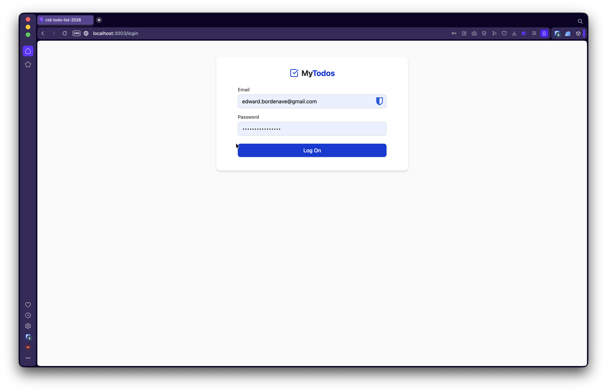
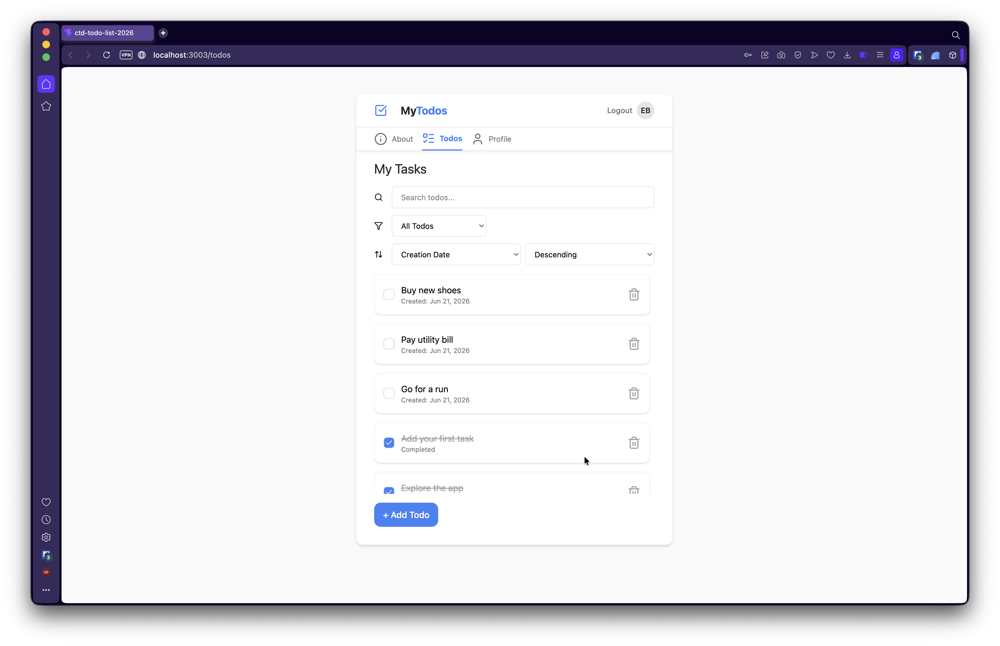
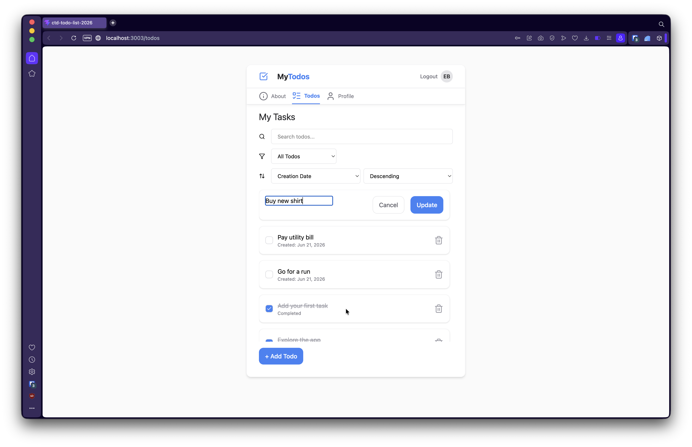
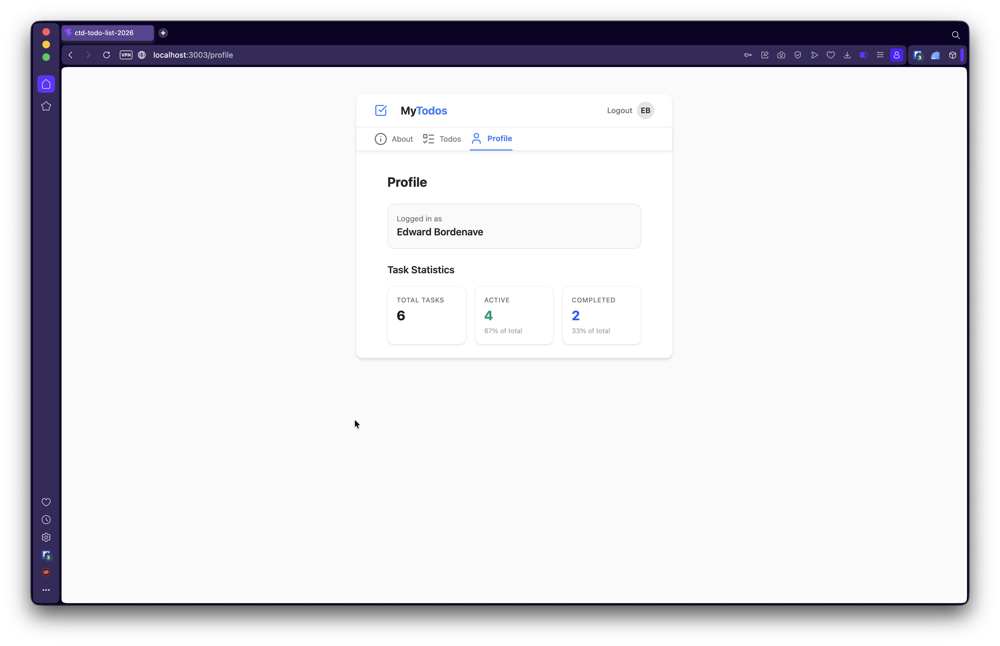
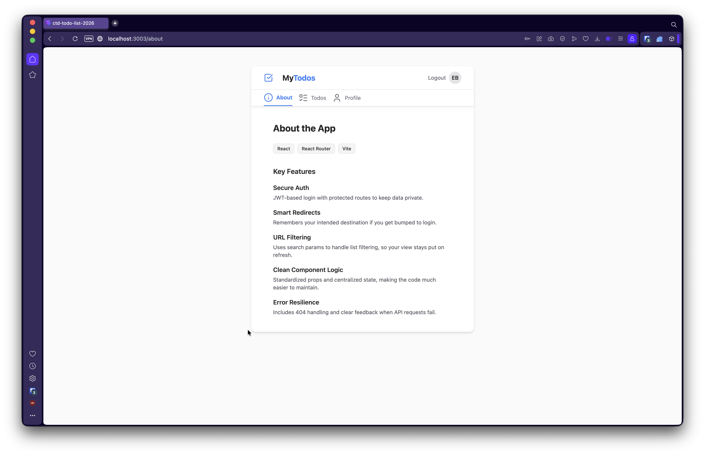
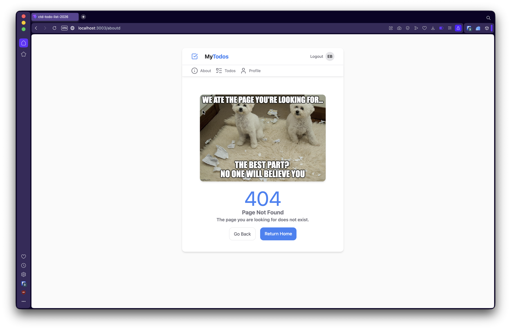
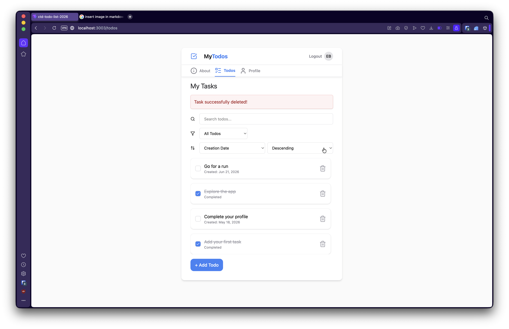
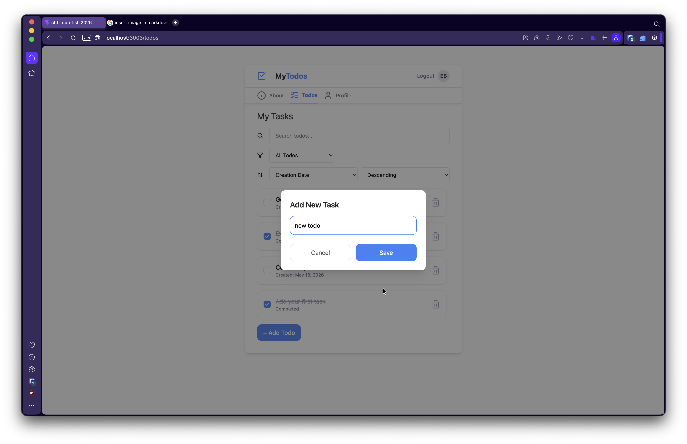
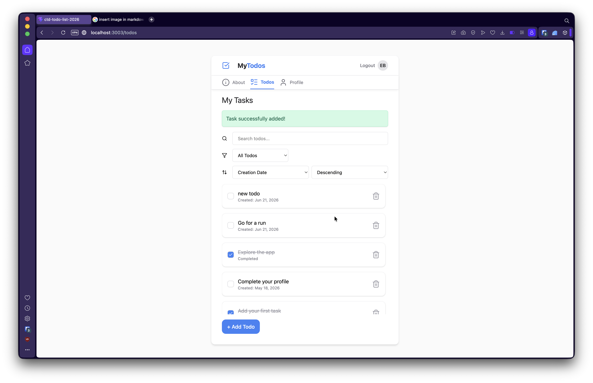

### Mobile View

_Add screenshot here_

### Feature Demo (Optional)

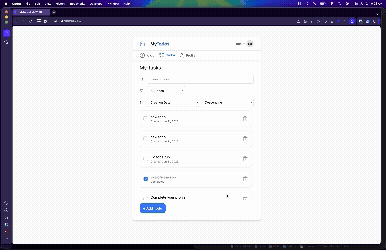

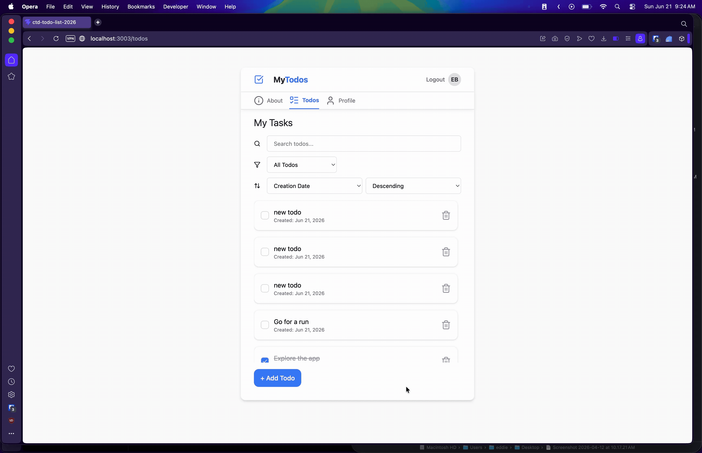

---

## Table of Contents

- [Features](#features)
- [Why I Built This](#why-i-built-this)
- [Installation](#installation)
- [Usage](#usage)
- [Project Structure](#project-structure)
- [Technologies Used](#technologies-used)
- [Design Decisions](#design-decisions)
- [Challenges Faced](#challenges-faced)
- [Future Improvements](#future-improvements)
- [License](#license)
- [Contact](#contact)

---

## Features

- Feature one
- Feature two
- Feature three
- Feature four

---

## Why I Built This

Explain why you built this project.

What were you trying to learn or improve?

---

## Installation

### Prerequisites

#### NVM

```bash
nvm -v
```

#### Node.js

```bash
node -v
```

#### npm

```bash
npm -v
```

---

### Clone the repository

```bash
git clone ctd-todo-list-2026
```

### Navigate into the project

```bash
cd your-project-name
```

### Install dependencies

```bash
npm install
```

### Run the development server

```bash
npm run dev
```

---

## Usage

Describe how to use the application.

Example:

1. First action
2. Second action
3. Third action
4. Fourth action

---

## Available Scripts

### `npm run dev`

Explain what this script does.

---

### `npm run build`

Explain what this script does.

---

### `npm run preview`

Explain what this script does.

---

## Project Structure

```text
src/
├── components/
├── features/
├── pages/
├── hooks/
├── reducers/
├── utils/
└── App.jsx
```

Brief explanation of your folder organization.

---

## Technologies Used

- Technology one
- Technology two
- Technology three
- Technology four

---

## Design Decisions

### State Management

Explain your approach and why.

---

### Security / Validation

Explain how you handle user input or data validation.

---

### Styling Approach

Explain your styling decisions.

---

### Architecture

Explain any notable architectural patterns.

---

## Challenges Faced

Describe challenges you encountered.

What was difficult?

How did you solve it?

What did you learn?

---

## Future Improvements

- Improvement one
- Improvement two
- Improvement three
- Improvement four

---

## License

This project is licensed under the **MIT** License.

See the `LICENSE` file for details.

---

## Contact

**Edward Bordenave**

GitHub: www.github.com/ebordenave

LinkedIn: www.linkedin.com/in/ebordenave

Email: edward.bordenave@gmail.com
